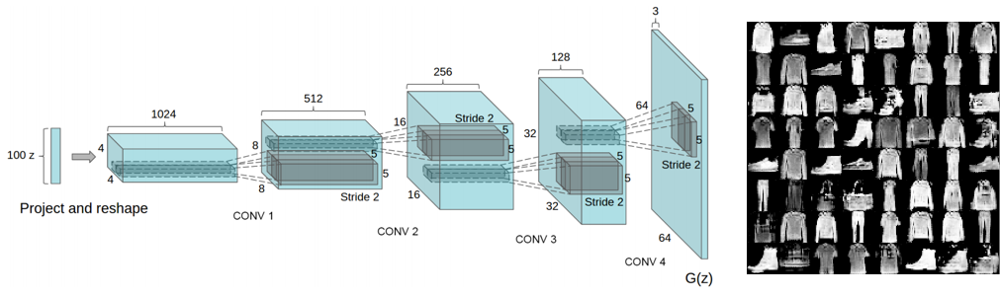
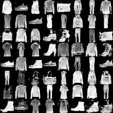
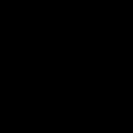

# Deep Convolutional Generative Adversarial Networks in Tensorflow

## Descriptions
This is my [Tensorflow](https://www.tensorflow.org/) implementation of **Deep Convolutional Generative Adversarial Networks in Tensorflow** proposed in the paper [Unsupervised Representation Learning with Deep Convolutional Generative Adversarial Networks](https://arxiv.org/abs/1511.06434). The main contribution comes from the tricks which stablize the training of Generative Adversarial Networks. The proposed architecture is as followed.



The implemented model is trained and tested on four publicly available datasets: [MNIST](http://yann.lecun.com/exdb/mnist/), [Fashion MNIST](https://github.com/zalandoresearch/fashion-mnist), [SVHN](http://ufldl.stanford.edu/housenumbers/), and [CIFAR-10](https://www.cs.toronto.edu/~kriz/cifar.html).

Note that this implementation only follows the main architecture of the original paper while differing a lot in implementation details such as hyperparameters, applied optimizer, etc. Also, some useful training tricks applied to this implementation are stated at the end of this README.

\*This code is still being developed and subject to change.

## Prerequisites

- Python 2.7 or Python 3.3+
- [Tensorflow 1.0.0](https://github.com/tensorflow/tensorflow/tree/r1.0)
- [SciPy](http://www.scipy.org/install.html)
- [NumPy](http://www.numpy.org/)

## Usage

### Download datasets
```bash
$ python download.py --dataset MNIST Fashion SVHN CIFAR10
```

### Train models with downloaded datasets:
```bash
$ python trainer.py --dataset Fashion
$ python trainer.py --dataset MNIST
$ python trainer.py --dataset SVHN
$ python trainer.py --dataset CIFAR10
```

### Test models with saved checkpoints:
```bash
$ python evaler.py --dataset Fashion --checkpoint ckpt_dir
$ python evaler.py --dataset MNIST --checkpoint ckpt_dir
$ python evaler.py --dataset SVHN --checkpoint ckpt_dir
$ python evaler.py --dataset CIFAR10 --checkpoint ckpt_dir
```
The *ckpt_dir* should be like: ```train_dir/default-MNIST_lr_0.0001-20170101-123456/model-1001```

### Train and test your own datasets:

* Create a directory
```bash
$ mkdir datasets/YOUR_DATASET
```

* Store your data as an h5py file datasets/YOUR_DATASET/data.hy and each data point contains
    * 'image': has shape [h, w, c], where c is the number of channels (grayscale images: 1, color images: 3)
* Maintain a list datasets/YOUR_DATASET/id.txt listing ids of all data points
* Modify trainer.py including args, data_info, etc.
* Finally, train and test models:
```bash
$ python trainer.py --dataset YOUR_DATASET
$ python evaler.py --dataset YOUR_DATASET --train_dir dir
```
The *dir* should be like: ```train_dir/default-MNIST_lr_0.0001-20170101-123456/model-1001```

## Results

### Fashion MNIST

* Generated samples (100th epochs)



* First 40 epochs



### MNIST

* Generated samples (100th epochs)


* First 40 epochs


### SVHN

* Generated samples (100th epochs)


* First 160 epochs


### CIFAR-10

* Generated samples (1000th epochs)


* First 200 epochs


## Training details

### MNIST

* The loss of Discriminator

D_loss_real


D_loss_fake


D_loss (total loss)


* The loss of Generator

G_loss


### SVHN

* The loss of Discriminator

D_loss_real


D_loss_fake


D_loss (total loss)


* The loss of Generator

G_loss


### CIFAR-10

* The loss of Discriminator

D_loss_real


D_loss_fake


D_loss (total loss)


* The loss of Generator

G_loss


## Training tricks

* To avoid the fast convergence of the discriminator network
    * The generator network is updated more frequently.
    * Higher learning rate is applied to the training of the generator.
* One-sided label smoothing is applied to the positive labels.
* Gradient clipping trick is applied to stablize training
* Reconstruction loss with an annealed weight is applied as an auxiliary loss to help the generator get rid of the initial local minimum.
* Utilize [Adam](https://arxiv.org/abs/1412.6980) optimizer with higher momentum.
* Please refer to the codes for more details.

## Related works
* [Unsupervised Representation Learning with Deep Convolutional Generative Adversarial Networks](https://arxiv.org/abs/1511.06434) by Radford
* [Fashion MNIST](https://github.com/zalandoresearch/fashion-mnist)
* My implementation of [Semi-supervised Learning Generative Adversarial Networks](https://github.com/shaohua0116/SSGAN-Tensorflow) in Tensorflow
* My implementation of [Generative Latent Optimization](https://github.com/shaohua0116/Generative-Latent-Optimization-Tensorflow) in Tensorflow

## Author

Shao-Hua Sun / [@shaohua0116](https://shaohua0116.github.io/)
